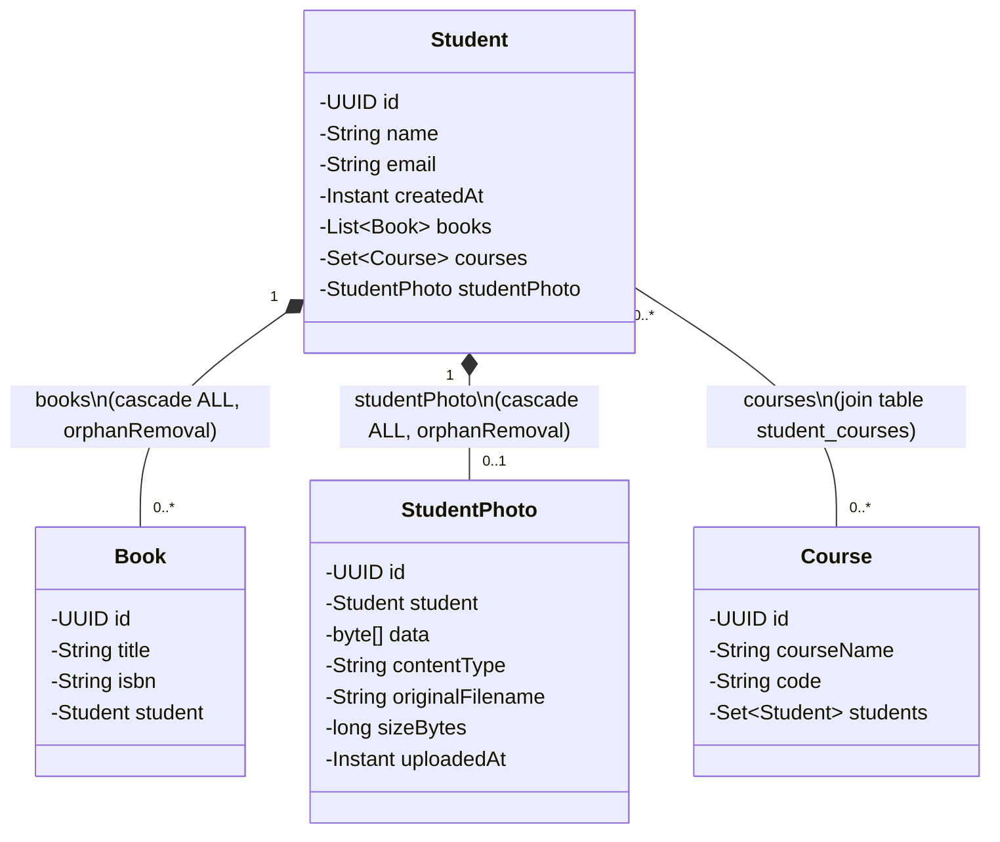

# Student Management

A Spring Boot REST API for managing students, their book loans, course enrollments, and ID photos.

## Features

- **Student records** — create, read, update, delete, and search (by name, paginated). Email is required and validated on creation.
- **Book lending** — track books by title/ISBN and assign them to at most one student at a time; a book must be returned before it can be reassigned.
- **Course enrollment** — enroll/un-enroll students in courses (many-to-many); a student cannot be enrolled in the same course twice.
- **Student photos** — upload, retrieve, and delete a single ID photo per student (max 2 MB per file).
- **Referential integrity** — deleting a student cascades to their books and photo; deleting a course detaches it from every enrolled student.
- **Paginated, validated API** — list endpoints support pagination/sorting; request bodies are validated with structured JSON error responses.

## Tech Stack

- Java 25, Spring Boot 4.1 (Web MVC, Data JPA, Validation)
- PostgreSQL
- springdoc-openapi (Swagger UI)
- JUnit 5 / Mockito, H2 (test scope)
- Lombok

## Architecture

Full diagrams with field-level detail and method signatures are in [docs/uml.md](docs/uml.md); the domain model is reproduced here.

## Known Limitations

- Access control is a single shared API key — there are no user identities, roles, or per-resource authorization.
- Email uniqueness is enforced on creation only, not on update.
- Photo uploads are not validated for content type or emptiness beyond the configured size limit.
