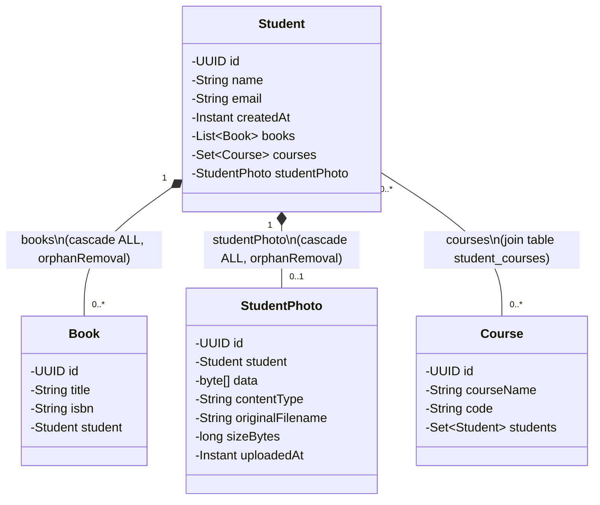
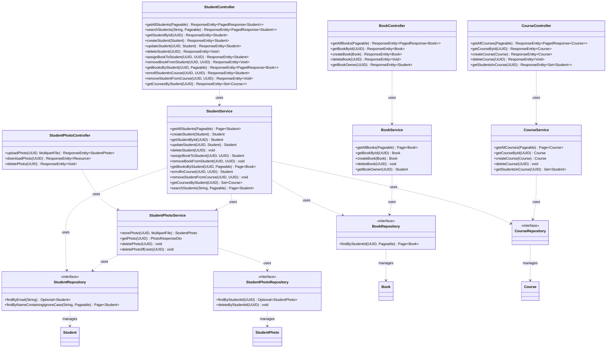

# UML Diagrams — student-management

This document describes the design of the `student-management` Spring Boot application as two UML class diagrams, rendered with [Mermaid](https://mermaid.js.org/) so they display natively on GitHub and in most IDEs.

The codebase (base package `com.example.student_management`) is organized into:

- `domain/` — the 4 JPA entities (`Student`, `Book`, `Course`, `StudentPhoto`)
- `repository/` — Spring Data JPA repository interfaces, one per entity
- `service/` — business logic, one service per entity/aggregate
- `controller/` — REST controllers exposing `/api/**` endpoints, one per entity
- `dto/` — response-shaping records (`PagedResponse<T>`, `PhotoResponseDto`) not shown below, as they don't mirror the domain model
- `exceptions/`, `filter/`, `interceptor/`, `config/` — cross-cutting infrastructure (error handling, logging, API-key auth, MVC config), omitted from these diagrams since they add no class-association structure

There is no inheritance or enum usage anywhere in the domain model.

## 1. Domain model

Entities, fields, and JPA-derived relationships/cardinalities.

**Notes**
- `Student` ↔ `Book`: bidirectional one-to-many, owning side `Book.student` (FK `books.student_id`). Deleting a `Student` deletes their `Book`s (composition).
- `Student` ↔ `Course`: bidirectional many-to-many, owning side `Student.courses`, via join table `student_courses(student_id, course_id)`.
- `Student` ↔ `StudentPhoto`: bidirectional one-to-one, owning side `StudentPhoto.student` (unique FK `student_photos.student_id`). Deleting a `Student` deletes their photo (composition).

## 2. Layered architecture

Controllers depend on services, services depend on repositories (and, for `StudentService`, on `StudentPhotoService`), and repositories manage entities. Method lists are abbreviated to their signatures.

